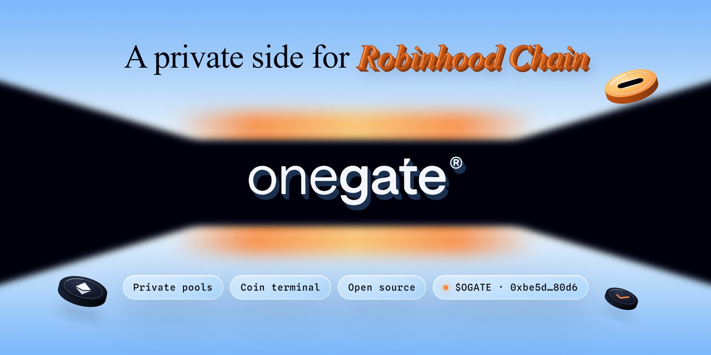
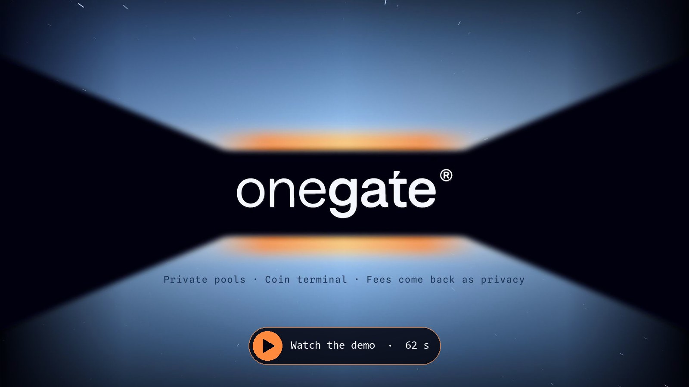
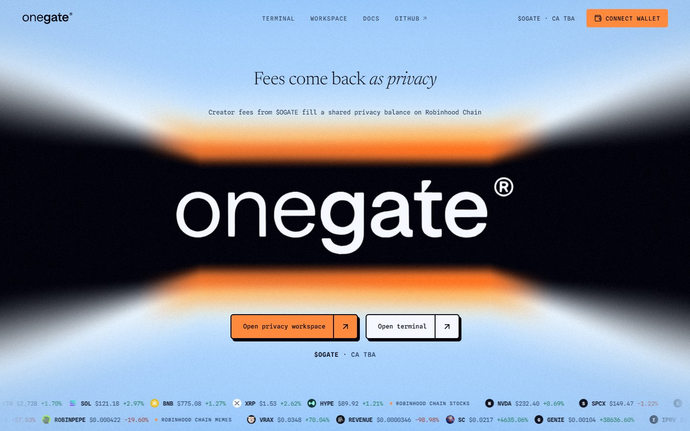
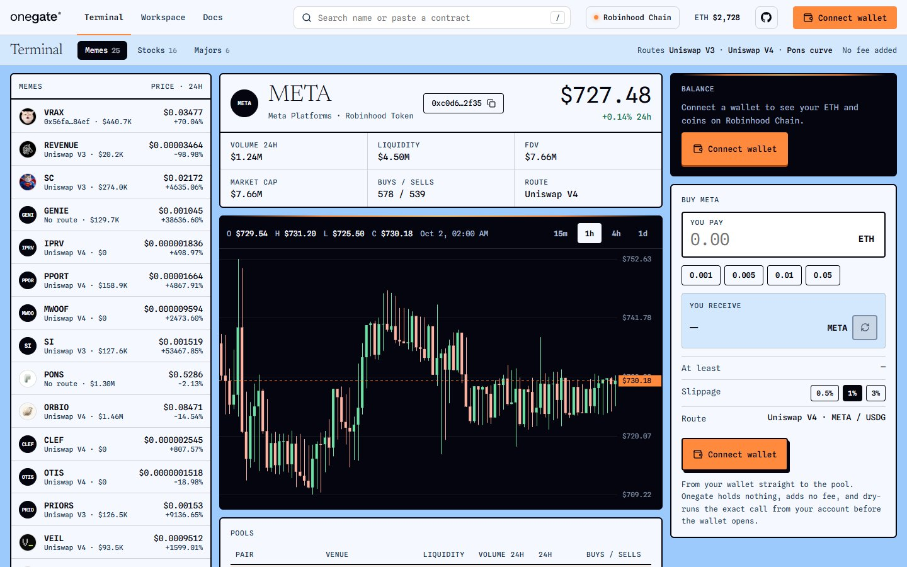
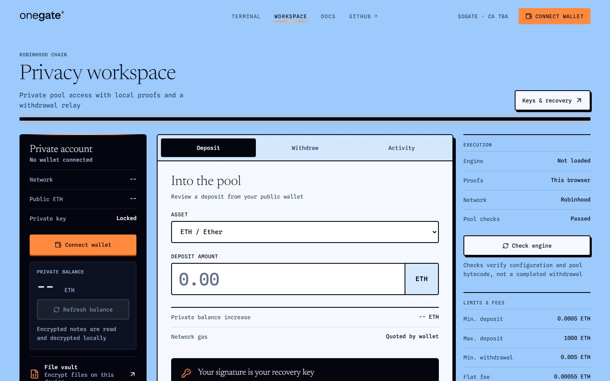
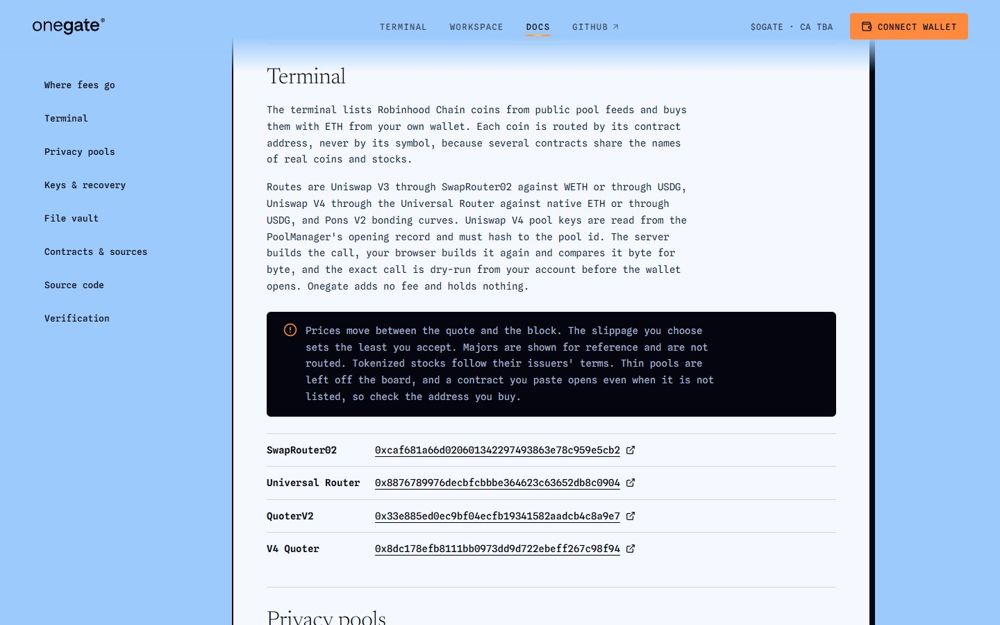

<a href="https://onegate-privacy.vercel.app"></a>

<h1 align="center">Onegate</h1>
<p align="center"><strong>A private side for Robinhood Chain</strong></p>

<p align="center">
  <a href="https://onegate-privacy.vercel.app">Open Onegate</a> &nbsp; / &nbsp;
  <a href="https://onegate-privacy.vercel.app/docs">Product docs</a> &nbsp; / &nbsp;
  <a href="docs/GETTING_STARTED.md">Get started</a> &nbsp; / &nbsp;
  <a href="docs/ARCHITECTURE.md">Architecture</a>
</p>

<p align="center">
  <a href="https://github.com/Onegategit/Onegate-Privacy/actions/workflows/ci.yml"></a>
</p>

Deposit into a privacy pool from your own wallet, let your browser build the proof, and withdraw to any address you choose. Next to it sits a terminal for the chain's memes and tokenized stocks, so you can read a coin and buy it with ETH in the same place.

**Private pools** - ETH and USDG pools on Robinhood Chain through Privacy Cash EVM 1.3.3, with proofs built in a browser worker from pinned circuit files, open to wallets holding at least $150 of $OGATE

**Coin terminal** - Memes, tokenized stocks and majors with charts, pools and your balance, bought with ETH on Uniswap V3, Uniswap V4 or a Pons curve

**Fees come back as privacy** - $OGATE creator fees fill a shared privacy balance for holders, $OGATE stake and the treasury (shares TBA)

## Demo

<a href="docs/assets/onegate-demo.mp4"></a>

<p align="center"><a href="docs/assets/onegate-demo.mp4">Watch the one minute demo</a></p>

## Screens

| Home | Terminal |
| --- | --- |
|  |  |
| **Privacy workspace** | **Docs** |
|  |  |

## Explore The Code

| Area | What is included |
| --- | --- |
| Gate | The supplied logo redrawn as a fragment shader, one scroll flight through its slot, the traced lettering with pointer particles |
| Terminal | Coin list by group, search by name or contract, candle chart, pools table, wallet balance via Multicall3, buy panel with slippage |
| Routes | Uniswap V3 (SwapRouter02, QuoterV2), Uniswap V4 (Universal Router, V4 Quoter, pool keys read from the PoolManager) and Pons V2 curves |
| Privacy | Connect, unlock, prove and review as separate steps, fixed sign-in message, payload guards before the wallet or relay is asked |
| Vault | AES-256-GCM file encryption in the browser with PBKDF2-SHA256, nothing uploaded |
| Checks | Unit tests for route encoding, privacy guards, engine integrity and the vault; browser checks at five widths with a stand-in wallet |

## How A Buy Is Checked

1. The server finds the pool the coin really trades in and reads the route from the chain
2. Contract code on the route is compared with pinned hashes; a change pauses buys
3. The server quotes the trade and builds the call
4. Your browser builds the same call again and compares the two byte for byte
5. The exact call is dry-run from your account (eth_call and gas estimate)
6. Only then does your wallet open, and you sign the transaction yourself

Onegate adds no fee on top and never holds your ETH.

## How A Private Deposit Works

1. **Connect** reads your public balance, no signature and no transfer
2. **Unlock** signs one fixed message, `Privacy Money account sign in`, and derives your private account inside the tab
3. **Prove** builds the zero knowledge proof in a separate browser worker from pinned circuit files
4. **Review** shows amount, recipient and fees on one screen before your wallet or the relay is asked for anything

Privacy is not anonymity. Your wallet address, timing and amounts stay public on chain, and the RPC, indexer and relay providers see network metadata. The docs page spells out what remains visible.

## Run Locally

Use Node.js 22.14+ or 24 and pnpm 10.10.0

```sh
pnpm install --frozen-lockfile
pnpm dev
```

Open http://localhost:5586

No API key or server secret is needed. The dev server serves `/api/terminal` and `/api/privacy` through the same handlers Vercel runs. Live data depends on the public Robinhood Chain RPC and market indexes being reachable.

```sh
pnpm test     # unit tests
pnpm build    # production build
pnpm check    # browser checks, with the dev server running
```

The browser checks use Playwright's Chromium (`pnpm exec playwright install chromium`, or set `CHROME_PATH`). See [Getting started](docs/GETTING_STARTED.md) for routes, scripts and deployment.

## Contracts On Robinhood Chain

These are external protocol contracts the interface reads or calls. None of them is an Onegate token or treasury.

| Contract | Address |
| --- | --- |
| Privacy Cash ETH pool | [`0xEC5266c9e44631e1ba22FD6377C38130c1F3B738`](https://robinhoodchain.blockscout.com/address/0xEC5266c9e44631e1ba22FD6377C38130c1F3B738) |
| Privacy Cash USDG pool | [`0xBB0C7F576B7bdAa8f2a119cb295076aCD0C9013f`](https://robinhoodchain.blockscout.com/address/0xBB0C7F576B7bdAa8f2a119cb295076aCD0C9013f) |
| USDG | [`0x5fc5360D0400a0Fd4f2af552ADD042D716F1d168`](https://robinhoodchain.blockscout.com/address/0x5fc5360D0400a0Fd4f2af552ADD042D716F1d168) |
| WETH | [`0x0bd7d308f8e1639fab988df18a8011f41eacad73`](https://robinhoodchain.blockscout.com/address/0x0bd7d308f8e1639fab988df18a8011f41eacad73) |
| Uniswap SwapRouter02 | [`0xcaf681a66d020601342297493863e78c959e5cb2`](https://robinhoodchain.blockscout.com/address/0xcaf681a66d020601342297493863e78c959e5cb2) |
| Uniswap QuoterV2 | [`0x33e885ed0ec9bf04ecfb19341582aadcb4c8a9e7`](https://robinhoodchain.blockscout.com/address/0x33e885ed0ec9bf04ecfb19341582aadcb4c8a9e7) |
| Uniswap V3 Factory | [`0x1f7d7550b1b028f7571e69a784071f0205fd2efa`](https://robinhoodchain.blockscout.com/address/0x1f7d7550b1b028f7571e69a784071f0205fd2efa) |
| Uniswap Universal Router | [`0x8876789976decbfcbbbe364623c63652db8c0904`](https://robinhoodchain.blockscout.com/address/0x8876789976decbfcbbbe364623c63652db8c0904) |
| Uniswap V4 PoolManager | [`0x8366a39cc670b4001a1121b8f6a443a643e40951`](https://robinhoodchain.blockscout.com/address/0x8366a39cc670b4001a1121b8f6a443a643e40951) |
| Uniswap V4 Quoter | [`0x8dc178efb8111bb0973dd9d722ebeff267c98f94`](https://robinhoodchain.blockscout.com/address/0x8dc178efb8111bb0973dd9d722ebeff267c98f94) |
| Pons V2 factory | [`0x7ed598bcef8bd9edd8c97a195c6d13f40801ec7e`](https://robinhoodchain.blockscout.com/address/0x7ed598bcef8bd9edd8c97a195c6d13f40801ec7e) |
| Multicall3 | [`0xca11bde05977b3631167028862be2a173976ca11`](https://robinhoodchain.blockscout.com/address/0xca11bde05977b3631167028862be2a173976ca11) |

Runtime code hashes for the router, quoter, factory and pool manager contracts were read on October 1, 2026 and are pinned in [`server/terminal.js`](server/terminal.js).

## Current Boundaries

- The interface is unaudited and independent; it is not affiliated with Robinhood or endorsed by the integrated protocols
- No funded deposit or withdrawal has been claimed; payload guards are tested with fixtures and an unfunded proof run
- Hardware wallets are not supported by the privacy SDK; the same wallet and signing method are needed to recover a private balance
- Majors are shown for reference and are not routed; tokenized stocks follow their issuers' terms
- The privacy workspace opens for wallets holding at least $150 of $OGATE, priced on the launch curve and then on its deepest pool of at least $10K; the check runs in the interface, and the terminal stays open to everyone
- Pools under $1K of liquidity are ignored for routes, prices and stats; a Pons launch still on its curve is always bought on the curve
- Terminal caches and request budgets are per server instance, not a durable account-wide limit
- The $OGATE fee split is TBA; the shares will be posted on the docs page
- $OGATE has no market index yet, so the terminal shows its curve quote but no price chart until one appears

## Project Identity

Ticker: **$OGATE**  
Network: **Robinhood Chain**  
Contract: [`0xbe5d432a0b30443987d261b664cc6bb8bccb80d6`](https://robinhoodchain.blockscout.com/token/0xbe5d432a0b30443987d261b664cc6bb8bccb80d6)

Supplied by the project owner and read on chain: name Onegate Privacy, symbol OGATE, 18 decimals, 1,000,000,000 supply, a Pons V2 launch paired with ETH. Open it in the terminal at [onegate-privacy.vercel.app/terminal/0xbe5d…](https://onegate-privacy.vercel.app/terminal/0xbe5d432a0b30443987d261b664cc6bb8bccb80d6).

This is the only $OGATE contract. Publishing source code does not establish contract safety, liquidity or an audit.

## Repository Map

```text
src/        React pages, the gate scene, terminal, privacy workspace and file vault
server/     Terminal data, route discovery, quotes and dry runs
api/        Vercel functions for /api/terminal and /api/privacy
scripts/    Browser checks, route probe and the wordmark tracer
tests/      Route encoding, privacy guards, engine integrity and vault tests
docs/       Setup, architecture and media
.github/    Build and test workflow
```

## Contributions And Rights

Read [CONTRIBUTING.md](CONTRIBUTING.md) before proposing a change. Report sensitive issues privately as described in [SECURITY.md](SECURITY.md).

A project-wide open-source license has not been selected. The code is published for public review, not represented as MIT or any other license. Third-party code keeps its own notices and licenses; see [THIRD_PARTY_NOTICES.md](THIRD_PARTY_NOTICES.md).
