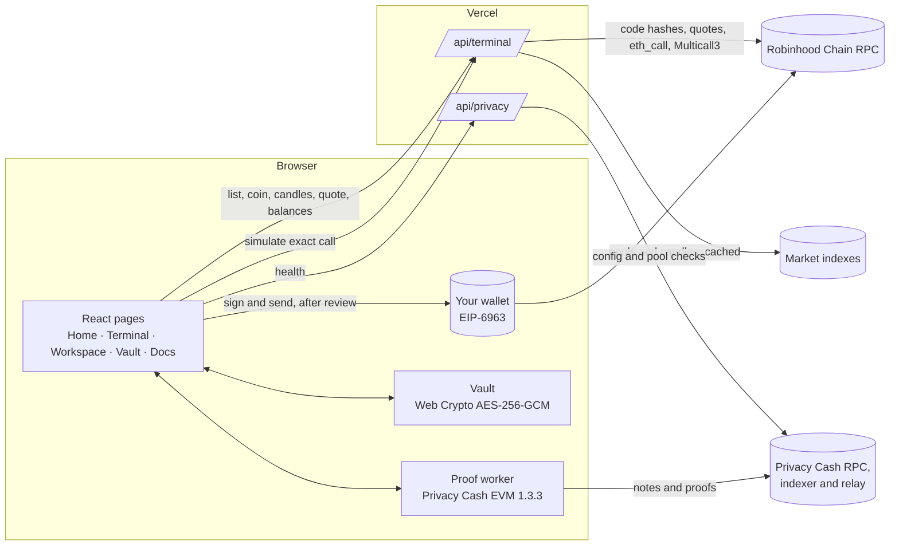

# Architecture

Onegate is a Vite + React single-page app with two serverless functions. Everything that signs runs in the user's wallet; everything that proves runs in the user's browser. The server reads public chain data, quotes routes and dry-runs calls. It holds no keys and no funds.

## Pages

| Route | File | What it does |
| --- | --- | --- |
| `/` | `src/Home.jsx`, `src/Scene.jsx`, `src/flight.js` | The logo's slot as a fragment shader; one pinned scroll flight whose stops (band, slope, glow, blur) come from a table, with a reduced-motion snap and a static fallback when WebGL is missing |
| `/terminal`, `/terminal/:address` | `src/Terminal.jsx` | App bar with search (`/` to focus), group tabs, coin list, coin header and stats, candle chart, pools, balance and buy panel |
| `/privacy` | `src/Privacy.tsx`, `src/privacy-*.ts`, `src/privacy.worker.ts` | Private pool workspace: connect, unlock, deposit or withdraw, review |
| `/vault` | `src/Vault.jsx`, `src/vault-crypto.js` | Browser-local file encryption |
| `/docs` | `src/main.jsx` | Fees, routes, privacy, recovery, contracts, source and verification |

The wordmark in `src/wordmark-path.js` is traced from the supplied artwork by `scripts/trace-wordmark.py`. Regenerate it with the script; do not edit the path by hand.

## Terminal

`api/terminal.js` is one function with five GET actions and one POST action. All logic lives in `server/terminal.js`.

| Action | Returns | Cache |
| --- | --- | --- |
| `list` | Memes, tokenized stocks and majors with price, 24h, volume, liquidity and route | 30 s at the edge |
| `coin` | One coin by contract, its pools and its buy route | 20 s |
| `candles` | OHLCV for a pool at 15m, 1h, 4h or 1d | 30 s |
| `quote` | Route, expected output, minimum output and the transaction to sign | none |
| `balances` | ETH and every listed coin for an account in one Multicall3 read | none |
| `simulate` (POST) | `eth_call` plus gas estimate of the exact transaction from the user's account | none |

### Routes

| Kind | Contract | Call |
| --- | --- | --- |
| Uniswap V3 | SwapRouter02 | `multicall(deadline, [exactInput(path, recipient, amountIn, minOut)])`, value = amountIn; the path starts at WETH and goes through USDG for coins paired with USDG |
| Uniswap V4 | Universal Router | `execute(0x10, [SWAP_EXACT_IN, SETTLE_ALL, TAKE_ALL])` from native ETH, through the ETH/USDG pool when the coin trades against USDG |
| Pons curve | The launch's curve | `buy(quoteIn, minTokensOut, recipient)` while the launch is still on its curve |

The encoders live in `src/terminal-route.js` so the server and the browser build the call with the same code. `tests/terminal-route.test.mjs` decodes each one.

V4 pool keys are not taken from the index. The server reads the PoolManager's `Initialize` event for the pool (searching near the pool's creation block) and accepts the key only when `keccak256(abi.encode(key))` equals the pool id.

### Guards before the wallet opens

1. Runtime code of SwapRouter02, QuoterV2, the V3 factory, Universal Router, V4 Quoter, PoolManager and the Pons factory is hashed and compared with pinned values, at most every ten minutes. A mismatch pauses buys.
2. The quote is taken on chain (QuoterV2, V4 Quoter or the curve's own math), and the minimum output applies the chosen slippage (0.5%, 1% or 3% in the panel; the server accepts 0.1% to 10%).
3. The browser re-encodes the call from the quoted route and refuses to continue unless it matches the server's bytes exactly.
4. `simulate` dry-runs that call from the user's account. Only the two routers and quoted curves can be simulated.
5. The wallet is asked to switch to Robinhood Chain and to send exactly that transaction.

Coins are matched by contract address, never by symbol: several contracts on the chain reuse the names of real coins and stocks. Thin pools are left off the list, and a pasted contract still opens so you can check it yourself.

### Budgets

Requests to the market index, RPC and pair lookups are counted per minute per instance, with in-flight de-duplication and stale-on-error caching. When a budget is spent the API answers 429 and the page says the terminal is cooling down.

## Privacy

The workspace wraps Privacy Cash EVM 1.3.3 for the ETH and USDG pools on Robinhood Chain.

- **Connect** finds wallets through EIP-6963 and reads the public balance.
- **Unlock** asks for one signature of the fixed message `Privacy Money account sign in`. The first unlock signs twice and compares the results, because a wallet that signs non-deterministically would derive a different private account. Signatures stay in memory and are cleared on lock, account or network change.
- **Prove** runs in `src/privacy.worker.ts` with the SDK's original `transaction2.wasm` and `transaction2.zkey`. `tests/engine-integrity.test.mjs` pins their hashes.
- **Review** shows the decoded deposit transaction (target, amount, native value, fee) or the relay payload (chain, amount, recipient, exact fee). `src/privacy-checks.ts` rejects anything that does not match what the user typed; `tests/privacy.test.ts` covers those guards. USDG deposits request an exact-amount approval, never unlimited.

`api/privacy.js` checks the provider configuration and that both pool contracts are deployed before the page offers any action.

## Vault

`src/vault-crypto.js` encrypts files up to 20 MB with AES-256-GCM, a random 96-bit nonce and a 128-bit salt, and derives the key with PBKDF2-SHA256 at 600,000 iterations. The file name is encrypted with the content in a versioned format. Nothing is uploaded.

## What the server never does

- Hold a private key, signature or seed
- Submit a transaction or a relay withdrawal on the user's behalf
- Add a fee to a buy
- Store wallet addresses beyond the request
